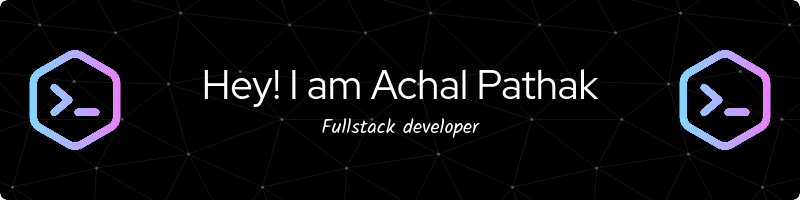

   &nbsp;
   &nbsp;
   &nbsp;

  📫 Email - pathak.achal5@gmail.com
### Hi there 👋

I am Achal Pathak, Fullstack developer, and I like to develop efficient and scalable systems.

### Technologies 💻

 &nbsp;
 &nbsp;
 &nbsp;
 &nbsp;
 &nbsp;
 
 &nbsp;
 &nbsp;
 &nbsp;
 &nbsp;
 &nbsp;
 
 &nbsp;
 &nbsp;
 &nbsp;
 &nbsp;
 
 &nbsp;
 &nbsp;
 &nbsp;
 &nbsp;
 &nbsp;

### Stats 📈

